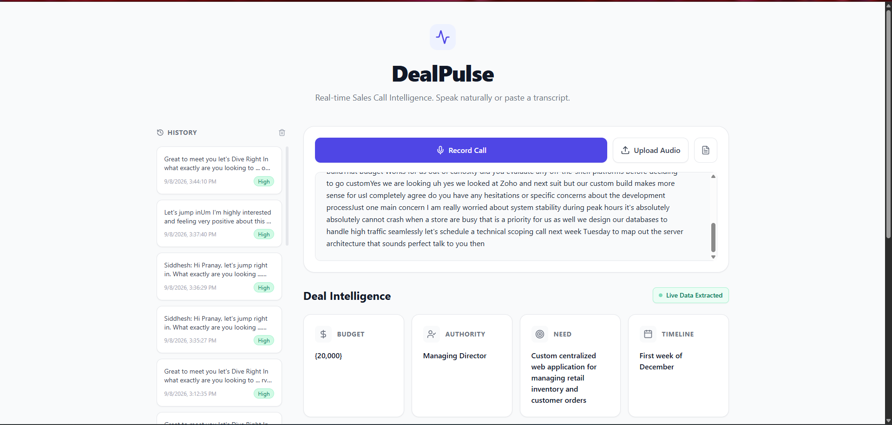
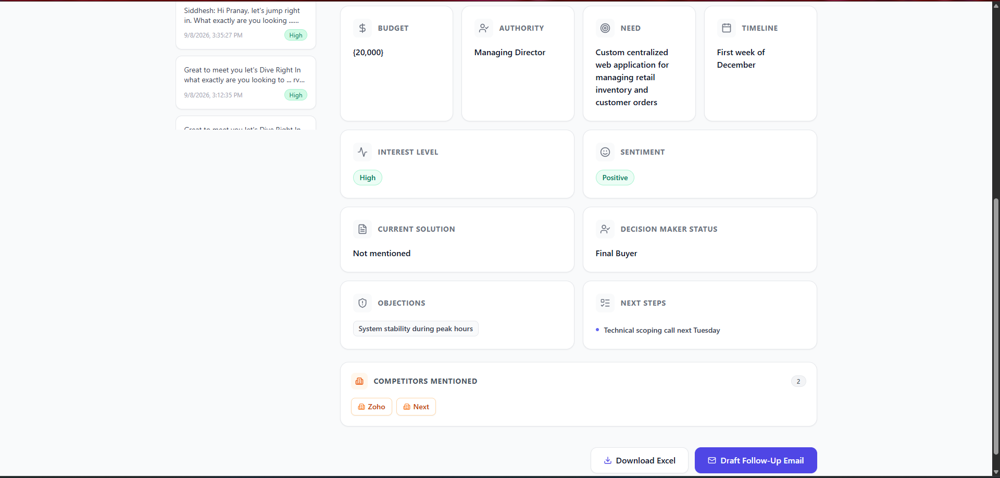
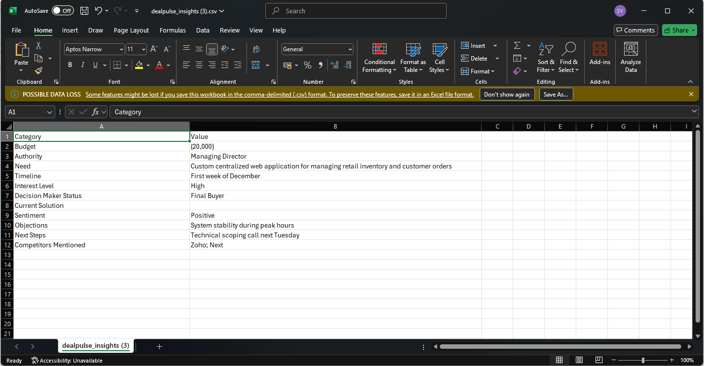
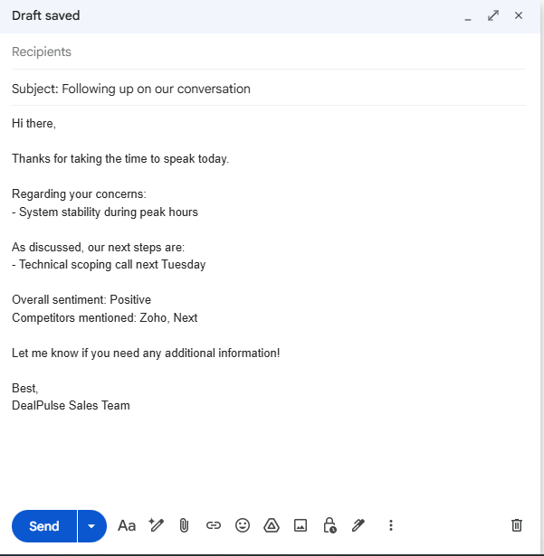

# DealPulse AI 🎯

**A fully local, offline Sales CRM assistant powered by AI.** Record or paste a sales call and instantly get structured deal intelligence — budget, authority, timeline, sentiment, competitors, objections, and next steps — without ever sending data to the cloud.

Built on a local LLM (Ollama + `qwen2.5:7b`) for deal extraction and a local Whisper model (`faster-whisper`) for speech-to-text, wrapped in a modern React dashboard with a persistent call-history sidebar and one-click Excel export.

> 🔒 **Privacy-first:** every model runs on your machine. Nothing leaves your computer.

---

## 🖥️ Demo

### Screenshots

| | |
|---|---|
|  |  |
|  |  |

### Video walkthrough

<video src="screenshots/demo.mp4" controls width="100%"></video>

> *The 2.5-minute demo above shows the full flow: record a call → automatic local transcription → AI deal extraction → insights rendered in the dashboard.*

---

## ✨ Features

- 🎙️ **Voice capture** — record a call with your microphone; audio is transcribed locally with OpenAI Whisper (`faster-whisper`)
- 📝 **Manual input** — paste any transcript and analyze it instantly
- 🤖 **AI deal intelligence** — extracts a rich CRM record from every conversation:
  - Budget, Authority (decision-maker), Need, Timeline
  - Interest level (High / Medium / Low) and **sentiment** (Positive / Neutral / Hesitant / Negative)
  - **Current solution**, **competitors mentioned**, **decision-maker status**, objections, next steps
- 📂 **Call history sidebar** — every analysis is saved (localStorage, up to 25 entries) and clickable to reload
- 📤 **Audio file upload** — analyze a pre-recorded call from disk
- 📊 **Excel export** — download any deal's intelligence as a spreadsheet (.xls)
- ✉️ **Follow-up email drafts** — auto-generated with objections, next steps, and insights
- 💯 **Fully offline** — Ollama LLM + local Whisper, no APIs, no data leaves the machine
---

## 🧱 Tech Stack

| Layer | Technology |
|---|---|
| Backend | Python 3.14 · FastAPI · Uvicorn |
| LLM | Ollama (`qwen2.5:7b`, structured JSON output) |
| Speech-to-Text | `faster-whisper` (CTranslate2, `base` model, CPU) |
| Frontend | React 19 · Vite 8 · Tailwind CSS 3 · Framer Motion · lucide-react |

## 🔄 How It Works

```
Record (mic) or upload audio
        │
        ▼
POST /transcribe  ──►  faster-whisper (local)  ──►  "transcript text"
        │
        └──────────────────────────┐
                                   ▼
        Paste transcript  ──►  POST /analyze
                                   │
                                   ▼
              Ollama qwen2.5:7b (JSON-schema-constrained CRM extraction)
                                   │
                                   ▼
        Rich CRM record ──► React dashboard + call history (localStorage)
```

## 🚀 Getting Started

### Prerequisites
- **Python 3.12+** and Node.js 18+
- **Ollama** installed & running (`http://127.0.0.1:11434`) with the model pulled:
  ```powershell
  ollama pull qwen2.5:7b
  ```
- Whisper `base` model is downloaded automatically on first transcription (~150 MB) into `~/.cache/huggingface`.

### 1. Backend

```powershell
python -m venv venv
.\venv\Scripts\Activate.ps1
pip install -r requirements.txt

# start the API (auto-reload)
uvicorn backend.main:app --reload
```
> API available at `http://127.0.0.1:8000` — interactive docs at `/docs`.

Optional Whisper tweaks (environment variables):
```powershell
$env:WHISPER_MODEL = "small"    # better accuracy, slower (base / small / medium)
$env:WHISPER_DEVICE = "cpu"     # or "cuda" if you have a CUDA GPU
$env:WHISPER_COMPUTE_TYPE = "int8"
```

### 2. Frontend

```powershell
cd frontend
npm install
npm run dev
```
> Open **http://localhost:5173/** in your browser.

> ⚠️ Run `npm run dev` from inside `frontend/` — the repo root has no `package.json`.

## 📡 API

| Method | Endpoint | Body | Returns |
|---|---|---|---|
| `POST` | `/analyze` | `{ "transcript": "..." }` | Full `CRMData` JSON — budget, authority, need, timeline, interest_level, objections, next_steps, current_solution, competitors_mentioned, decision_maker_status, sentiment |
| `POST` | `/transcribe` | multipart `file` (webm/ogg/wav…) | `{ "transcription": "...", "language": "en" }` |
| `GET` | `/docs` | – | Interactive OpenAPI docs |

## 📁 Project Structure

```
dealpulse-ai/
├── backend/
│   └── main.py                 # FastAPI app (analyze + transcribe endpoints)
├── frontend/
│   ├── src/
│   │   ├── App.jsx             # Main UI: input panel, insights grid, history sidebar
│   │   ├── CRMCard.jsx         # Reusable insight card component
│   │   └── hooks/
│   │       └── useSpeechRecognition.js  # MediaRecorder → /transcribe pipeline
│   ├── index.html
│   └── package.json
├── screenshots/                # Demo media used in this README
├── test_backend.py             # Smoke test for /analyze
└── requirements.txt
```

## 📅 Roadmap / Notes

- The 7B model is good but sometimes conservative on the newer fields (competitors / current solution); a larger model (`qwen2.5:14b`) or few-shot prompt examples would sharpen extraction.
- Call history currently lives in `localStorage`; upgrading to IndexedDB or a backend store would make it durable across browsers.
- First `/analyze` after Ollama has been idle is slow (model reload, ~15–25 s); subsequent calls are fast while the model stays loaded.

---

**MIT** · Built with FastAPI, Ollama, Whisper, and React.